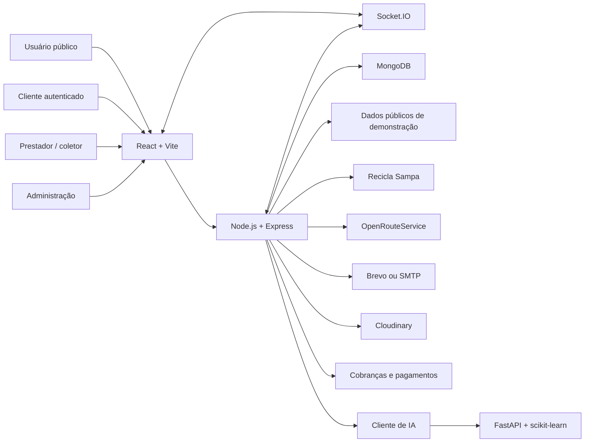
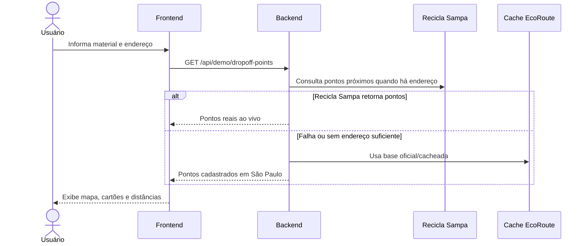
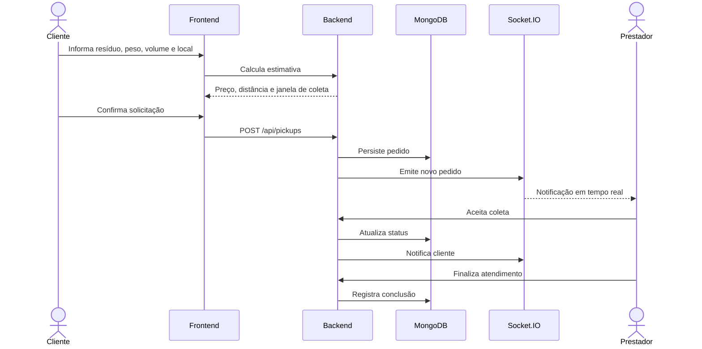

# EcoRoute

**Plataforma web para gerenciamento, descarte e coleta inteligente de resíduos urbanos.**

EcoRoute é um sistema full-stack desenvolvido para apoiar a destinação correta de resíduos recicláveis e a solicitação de coletas em residências, empresas e outros pontos urbanos. A proposta central é combinar um mapa de pontos reais de descarte, fluxo de solicitação de coleta sob demanda, painéis operacionais para prestadores, área administrativa, banco de dados, autenticação, dashboards e comunicação em tempo real.

O projeto foi adaptado para o contexto brasileiro e preparado como parte prática de um trabalho acadêmico de Sistemas de Informação.

## Sumário

- [Visão Geral](#visão-geral)
- [Objetivo Acadêmico](#objetivo-acadêmico)
- [Demonstração Online](#demonstração-online)
- [Perfis de Demonstração](#perfis-de-demonstração)
- [Principais Funcionalidades](#principais-funcionalidades)
- [Arquitetura](#arquitetura)
- [Tecnologias](#tecnologias)
- [Estrutura do Repositório](#estrutura-do-repositório)
- [Fluxos do Sistema](#fluxos-do-sistema)
- [Mapa e Pontos de Descarte](#mapa-e-pontos-de-descarte)
- [Coleta Sob Demanda](#coleta-sob-demanda)
- [Painel do Cliente](#painel-do-cliente)
- [Painel do Prestador](#painel-do-prestador)
- [Painel de Administração](#painel-de-administração)
- [Autenticação e Sessões Demo](#autenticação-e-sessões-demo)
- [API Backend](#api-backend)
- [Modelagem de Dados](#modelagem-de-dados)
- [Serviço de IA e Agenda Inteligente](#serviço-de-ia-e-agenda-inteligente)
- [Tempo Real com Socket.IO](#tempo-real-com-socketio)
- [Pagamentos e Cobranças](#pagamentos-e-cobranças)
- [Instalação Local](#instalação-local)
- [Variáveis de Ambiente](#variáveis-de-ambiente)
- [Scripts Disponíveis](#scripts-disponíveis)
- [Testes e Qualidade](#testes-e-qualidade)
- [Deploy](#deploy)
- [Segurança](#segurança)
- [Limitações Conhecidas](#limitações-conhecidas)
- [Roadmap Sugerido](#roadmap-sugerido)
- [Créditos e Licença](#créditos-e-licença)

## Visão Geral

A EcoRoute resolve dois problemas práticos:

1. **Descarte correto de resíduos**: o cidadão informa material, localização ou endereço e visualiza pontos apropriados de descarte próximos, com dados reais/cadastrados para São Paulo.
2. **Coleta inteligente sob demanda**: o usuário solicita retirada de resíduos em residência, empresa ou outro local, com estimativa de preço baseada em distância, complexidade, tipo de material, peso/volume e regras de precificação.

Além da experiência pública, a aplicação inclui painéis internos para acompanhar pedidos, pagamentos, veículos, coletores, organizações, usuários, relatórios e agenda operacional.

## Objetivo Acadêmico

Curso: **Sistemas de Informação**

Tema: **Plataforma web para Gerenciamento e Coleta Inteligente de Resíduos Urbanos**

Nome da plataforma: **EcoRoute**

Requisitos atendidos pela aplicação:

- aplicação web funcional;
- frontend separado;
- backend separado;
- banco de dados;
- mapa funcional;
- consulta e exibição de pontos de descarte;
- solicitação de coleta por usuário;
- cadastro/autenticação;
- painel para cliente;
- painel para prestador/coletor;
- painel administrativo;
- arquitetura documentada;
- rotas de API;
- uso de tecnologias reais de mercado.

## Demonstração Online

Instância publicada no Railway:

- Frontend: [https://frontend-production-abe7a.up.railway.app](https://frontend-production-abe7a.up.railway.app)
- Backend/API: [https://backend-production-a606.up.railway.app](https://backend-production-a606.up.railway.app)
- Health check da API: [https://backend-production-a606.up.railway.app/api/health](https://backend-production-a606.up.railway.app/api/health)

Rotas úteis:

- Landing page: `/`
- Experiência pública de descarte/coleta: `/request-pickup`
- Entrada demo cliente: `/demo/cliente`
- Entrada demo prestador: `/demo/prestador`
- Entrada demo administração: `/demo/dono`
- Login manual: `/login`

## Perfis de Demonstração

Os perfis abaixo foram criados para apresentação sem depender de cadastro real:

| Perfil | E-mail | Senha | Rota rápida | Finalidade |
| --- | --- | --- | --- | --- |
| Cliente | `demo@ecoroute.com.br` | `EcoRoute@2026` | `/demo/cliente` | Solicitar coleta, consultar agenda, ver cobranças e painel do cliente. |
| Prestador | `prestador@ecoroute.com.br` | `EcoRoute@2026` | `/demo/prestador` | Ver pedidos pendentes, agenda de áreas e fluxo operacional de coleta. |
| Administração | `dono@ecoroute.com.br` | `EcoRoute@2026` | `/demo/dono` | Acessar visão de dono/superadministrador, relatórios, organizações, veículos, usuários e cobrança. |

Esses perfis usam tokens fixos de demonstração no frontend. Chamadas de API desses perfis são interceptadas por mocks locais seguros quando necessário, evitando erro de token expirado em telas demonstrativas.

## Principais Funcionalidades

### Área pública

- Landing page institucional da EcoRoute.
- Apresentação de serviços, proposta ambiental e funcionalidades.
- Página de solicitação pública de coleta.
- Mapa com pontos de descarte.
- Filtros por material.
- Estimativa de coleta.
- Geração de protocolo demonstrativo.
- Páginas de ajuda, contato, equipe e sobre.

### Cliente

- Login por senha e fluxo de OTP.
- Dashboard com indicadores de coletas.
- Solicitação de coleta.
- Acompanhamento de status.
- Histórico de coletas.
- Tela de cobrança.
- Visualização de agenda pública.
- Perfil do usuário.
- Notificações de status em tempo real.

### Prestador/coletor

- Dashboard operacional.
- Lista de pedidos pendentes.
- Aceite de tarefa.
- Visualização de rota.
- Fluxo de atendimento da coleta.
- Atualização de status.
- Agenda diária por áreas.
- Notificações.
- Perfil.
- Navegação inferior otimizada para uso em celular.

### Administração

- Painel administrativo.
- Gestão de organizações.
- Gestão de usuários.
- Gestão de administradores.
- Gestão de veículos.
- Gestão de coletores.
- Gestão de áreas.
- Relatórios.
- Histórico operacional.
- Estatísticas de coletas.
- Configuração de preços.
- Cobranças e faturamento.
- Contato/suporte.
- Notificações internas.

## Arquitetura



### Separação principal

O sistema está organizado em três aplicações:

1. **Backend**
   - API REST;
   - autenticação;
   - regras de negócio;
   - persistência;
   - Socket.IO;
   - jobs agendados;
   - integração com serviços externos.

2. **Frontend**
   - SPA em React;
   - rotas públicas e protegidas;
   - dashboards;
   - mapas;
   - estados globais;
   - experiência mobile/desktop.

3. **ML**
   - serviço Python/FastAPI;
   - predição de volume;
   - agenda inteligente;
   - módulo experimental herdado, com necessidade de retreinamento para dados brasileiros em produção.

## Tecnologias

### Frontend

- React 19
- Vite
- React Router
- Zustand
- Axios
- Tailwind CSS
- Leaflet
- React Leaflet
- Lucide React
- Chart.js
- React Chart.js 2
- Socket.IO Client
- Three.js
- GSAP

### Backend

- Node.js
- Express 5
- MongoDB
- Mongoose
- Socket.IO
- JSON Web Token
- Helmet
- CORS
- Multer
- Cloudinary
- Nodemailer
- Brevo API
- Node Cron
- OpenRouteService

### Machine Learning

- Python
- FastAPI
- Uvicorn
- scikit-learn
- pandas
- numpy
- joblib
- pydantic

### Infraestrutura

- Railway para deploy do frontend, backend e MongoDB.
- MongoDB gerenciado no Railway.
- GitHub Actions para CI.

## Estrutura do Repositório

```text
ecoroute-platform/
  .github/
    workflows/
      ci.yml
  backend/
    app.js
    server.js
    config/
    controllers/
    data/
    domains/
    middlewares/
    models/
    routes/
    scripts/
    services/
    socket/
    tests/
    utils/
  frontend/
    index.html
    package.json
    railway.json
    server.js
    src/
      assets/
      components/
      context/
      hooks/
      pages/
      routes/
      stores/
      utils/
  ml/
    main.py
    model.py
    scheduler.py
    train.py
    requirements.txt
    data/
    models/
  .env.example
  .gitignore
  .railwayignore
  package.json
  package-lock.json
  railway.json
  README.md
```

## Fluxos do Sistema

### Fluxo público de descarte



### Fluxo de coleta sob demanda



## Mapa e Pontos de Descarte

O módulo público de mapa está focado no problema da destinação incorreta de resíduos. Ele oferece:

- pontos de descarte apropriados por material;
- filtros por tipo de resíduo;
- distância aproximada a partir da localização informada;
- integração com base pública quando possível;
- fallback para base local de pontos em São Paulo;
- exibição de origem da informação;
- interface visual com mapa Leaflet.

Materiais suportados no protótipo:

- recicláveis;
- papel;
- plástico;
- metal;
- vidro;
- eletrônicos;
- óleo;
- pilhas;
- lâmpadas;
- entulho;
- móveis;
- eletrodomésticos.

Arquivos principais:

- `backend/data/saoPauloDropoffPoints.js`
- `backend/services/ecorouteDemo.service.js`
- `backend/controllers/ecorouteDemo.controller.js`
- `backend/routes/ecorouteDemo.route.js`
- `frontend/src/pages/EcoRouteDemo.jsx`

## Coleta Sob Demanda

O módulo de coleta permite que o usuário informe:

- nome;
- contato;
- endereço;
- localização no mapa;
- tipo de material;
- peso estimado;
- volume estimado;
- observações.

O backend estima:

- categoria operacional;
- nível de complexidade;
- distância da base;
- preço estimado;
- composição do preço;
- duração aproximada;
- janela de atendimento.

O cálculo usa:

- regras de precificação;
- distância de rota;
- fallback geográfico quando o serviço externo de rota não responde;
- categoria do material;
- nível de dificuldade.

## Painel do Cliente

Rotas principais:

- `/customer-dashboard`
- `/schedule`
- `/upload-waste`
- `/billing`
- `/profile`

O painel do cliente exibe:

- total de pedidos;
- coletas concluídas;
- coletas em andamento;
- pendências;
- cancelamentos;
- cobranças;
- tendências;
- materiais;
- complexidade;
- histórico recente.

No modo demonstração, o cliente usa dados estáveis para apresentação.

## Painel do Prestador

Rotas principais:

- `/driver-dashboard`
- `/accept-task`
- `/task-route/:pickupId`
- `/task-flow/:pickupId`
- `/driver-ml-assignments`
- `/driver-notifications`
- `/profile`

O painel do prestador foi projetado para uso operacional em campo:

- cartões rápidos;
- navegação inferior;
- pedidos pendentes;
- aceite de coleta;
- agenda de áreas;
- rota;
- atualização de status;
- coleta ativa;
- alertas.

No modo demonstração, o prestador aparece como online sem abrir Socket.IO real, porque os tokens fixos de demo não são JWTs reais do backend.

## Painel de Administração

Rotas principais:

- `/admin-dashboard`
- `/admin-dashboard/organizations`
- `/admin-dashboard/my-organization`
- `/admin-dashboard/users`
- `/admin-dashboard/vehicles`
- `/admin-dashboard/drivers`
- `/admin-dashboard/reports`
- `/admin-dashboard/pickup-stats`
- `/admin-dashboard/history`
- `/admin-dashboard/pricing`
- `/admin-dashboard/billing`
- `/admin-dashboard/my-billing`
- `/admin-dashboard/contact`

O painel administrativo contempla:

- visão executiva;
- gráficos;
- relatórios;
- gestão de cooperativas/organizações;
- gestão de veículos;
- gestão de coletores;
- gestão de usuários;
- controle de faturas;
- configuração de preços;
- histórico de coletas;
- mensagens e notificações.

## Autenticação e Sessões Demo

O sistema suporta:

- login por senha;
- login por OTP;
- JWT;
- controle de papéis;
- rotas protegidas;
- demo com tokens fixos.

Papéis válidos:

| Papel | Descrição |
| --- | --- |
| `customer_admin` | Cliente final ou responsável por conta cliente. |
| `driver` | Prestador/coletor responsável por atendimento operacional. |
| `admin` | Administrador de uma organização/cooperativa. |
| `super_admin` | Dono ou administrador geral da plataforma. |

Arquivos principais:

- `frontend/src/stores/useAuthStore.js`
- `frontend/src/utils/demoAuth.js`
- `frontend/src/utils/demoApiMocks.js`
- `frontend/src/components/auth/ProtectedRoute.jsx`
- `backend/middlewares/auth.middleware.js`
- `backend/middlewares/role.middleware.js`

## API Backend

Prefixo padrão: `/api`

### Rotas públicas e institucionais

| Método | Rota | Descrição |
| --- | --- | --- |
| `GET` | `/api/health` | Verifica status da API. |
| `GET` | `/api/demo/dropoff-points` | Lista pontos de descarte por material/localização. |
| `POST` | `/api/demo/pickup-estimate` | Calcula estimativa demonstrativa de coleta. |
| `POST` | `/api/demo/pickup-requests` | Cria protocolo demonstrativo de coleta. |
| `GET` | `/api/demo/metrics` | Retorna métricas do módulo demo. |

### Autenticação

| Método | Rota | Descrição |
| --- | --- | --- |
| `POST` | `/api/auth/register` | Cadastro. |
| `POST` | `/api/auth/login` | Login por senha. |
| `POST` | `/api/auth/request-otp` | Solicita OTP. |
| `POST` | `/api/auth/verify-otp` | Verifica OTP. |
| `GET` | `/api/auth/me` | Retorna usuário autenticado. |

### Coletas

| Método | Rota | Descrição |
| --- | --- | --- |
| `GET` | `/api/pickups/pending` | Pedidos pendentes para prestadores. |
| `GET` | `/api/pickups/my` | Pedidos do cliente. |
| `POST` | `/api/pickups` | Cria pedido de coleta. |
| `POST` | `/api/pickups/:id/accept` | Prestador aceita pedido. |
| `PATCH` | `/api/pickups/:id/status` | Atualiza status. |
| `POST` | `/api/pickups/:id/cancel` | Cancela pedido. |

### Gestão

| Prefixo | Finalidade |
| --- | --- |
| `/api/super-admin` | Administração global. |
| `/api/org-admin` | Administração de organização. |
| `/api/driver` | Recursos do prestador. |
| `/api/user` | Recursos de usuário. |
| `/api/areas` | Áreas de atendimento. |
| `/api/location` | Localização e rotas. |
| `/api/schedule` | Agenda manual/legada. |
| `/api/ml-schedule` | Agenda inteligente. |
| `/api/notifications` | Notificações. |
| `/api/history` | Histórico. |
| `/api/pricing-config` | Configuração de preços. |
| `/api/payments` | Pagamentos. |
| `/api/billing` | Cobranças. |
| `/api/contact` | Contato/suporte. |
| `/api/internal-messages` | Mensagens internas. |

## Modelagem de Dados

Principais modelos Mongoose:

| Modelo | Responsabilidade |
| --- | --- |
| `User` | Usuários, papéis, credenciais e dados de contato. |
| `Organization` | Cooperativas/organizações participantes. |
| `Driver` | Perfil operacional de prestador/coletor. |
| `Truck` | Veículos, capacidade, placa e disponibilidade. |
| `PickupRequest` | Pedido de coleta sob demanda. |
| `PickupEvent` | Eventos de status do pedido. |
| `PickupDailySummary` | Agregações diárias para dashboards. |
| `Payment` | Pagamentos de coletas e faturas. |
| `Billing` | Faturas mensais. |
| `BillingConfig` | Regras de cobrança recorrente. |
| `PricingConfig` | Regras de preço por categoria/complexidade/distância. |
| `MLSchedule` | Agenda inteligente gerada por previsão. |
| `Area` | Áreas de atendimento. |
| `ContactMessage` | Mensagens de contato/suporte. |
| `InternalMessage` | Comunicação interna. |
| `notification` | Notificações persistentes. |
| `WasteUpload` | Evidências enviadas pelo cliente. |

## Serviço de IA e Agenda Inteligente

O backend possui um domínio de agenda inteligente em:

- `backend/domains/ml-schedules/`
- `backend/services/mlClient.js`

O serviço Python fica em:

- `ml/main.py`
- `ml/model.py`
- `ml/scheduler.py`
- `ml/train.py`

Importante:

- O serviço Python é um módulo experimental herdado.
- O dataset e parte da nomenclatura original ainda se referem a Kathmandu/Nepal.
- Para produção brasileira, o modelo deve ser retreinado com dados nacionais ou municipais.
- O backend possui fallback interno para gerar agenda mesmo quando o serviço ML está offline.
- Na instância Railway atual, o ML Python não está publicado separadamente; o backend usa a estratégia de contingência.

## Tempo Real com Socket.IO

O backend inicializa Socket.IO no mesmo servidor HTTP:

- `backend/socket/socketServer.js`

Eventos usados:

- `pickup:created`
- `pickup:accepted`
- `pickup:cancelled`
- `pickup:status`
- `pickup:statusUpdate`
- `payment:updated`
- `notification:new`
- `notification:counts`
- `schedule:confirmed`
- `schedule:updated`
- `assignment:completed`
- `schedule:area-completed`

Salas principais:

- `customer:<userId>`
- `driver:<userId>`
- `driver-org:<orgId>`
- `admins`
- `org:<orgId>`
- `super_admins`

O Socket.IO exige JWT válido. Sessões demo usam comportamento simulado no frontend.

## Pagamentos e Cobranças

O projeto contempla:

- pagamento de coleta;
- pagamento em dinheiro;
- status de pagamento;
- faturas mensais;
- confirmação administrativa;
- cobrança por cliente;
- cobrança por organização;
- relatórios de faturamento.

Há código herdado de integração eSewa no projeto original. Para uso brasileiro real, recomenda-se substituir por integração Pix nacional, como:

- PSP bancário;
- Mercado Pago;
- Gerencianet/Efi;
- Asaas;
- Pagar.me;
- Stripe com método local disponível.

## Instalação Local

### Pré-requisitos

- Node.js 22 ou superior.
- npm.
- MongoDB local ou MongoDB remoto.
- Python 3.11+ se for executar o módulo ML.

### 1. Clonar o repositório

```bash
git clone <url-do-repositorio>
cd ecoroute-platform
```

### 2. Instalar dependências do backend

```bash
npm install
```

### 3. Instalar dependências do frontend

```bash
cd frontend
npm install
cd ..
```

### 4. Configurar ambiente

```bash
cp .env.example .env
```

Edite `.env` com os valores locais.

### 5. Subir MongoDB

Exemplo com Docker:

```bash
docker run --name ecoroute-mongo -p 27017:27017 -d mongo:8.0
```

Ou use uma URL MongoDB Atlas/Railway em `MONGO_URL`.

### 6. Executar backend

```bash
npm run dev
```

Backend padrão:

```text
http://localhost:5001
```

### 7. Executar frontend

Em outro terminal:

```bash
cd frontend
npm run dev
```

Frontend padrão:

```text
http://localhost:5173
```

### 8. Abrir demonstração

```text
http://localhost:5173/demo
http://localhost:5173/demo/cliente
http://localhost:5173/demo/prestador
http://localhost:5173/demo/dono
```

## Variáveis de Ambiente

Arquivo base: `.env.example`

| Variável | Exemplo | Obrigatória | Descrição |
| --- | --- | --- | --- |
| `PORT` | `5001` | Sim | Porta do backend. |
| `NODE_ENV` | `development` | Sim | Ambiente de execução. |
| `APP_TIMEZONE` | `America/Sao_Paulo` | Sim | Fuso usado por jobs e agenda. |
| `MONGO_URL` | `mongodb://localhost:27017/ecoroute` | Sim | Conexão MongoDB. |
| `JWT_SECRET` | `replace-with-a-long-random-secret` | Sim | Segredo para assinar JWT. |
| `JWT_EXPIRES_IN` | `7d` | Sim | Validade do token. |
| `CRON_SECRET` | `replace-with-a-long-random-secret` | Recomendado | Protege endpoints de cron. |
| `FRONTEND_URL` | `http://localhost:5173` | Sim | Origem principal permitida. |
| `CORS_ALLOWED_ORIGINS` | `http://localhost:5173,http://127.0.0.1:5173` | Recomendado | Origens adicionais. |
| `BACKEND_URL` | `http://localhost:5001` | Sim | URL pública/local do backend. |
| `ML_SERVICE_URL` | `http://localhost:8000` | Opcional | URL do serviço ML. |
| `CLOUDINARY_CLOUD_NAME` | `your-cloudinary-cloud-name` | Opcional | Uploads de evidência. |
| `CLOUDINARY_API_KEY` | `your-cloudinary-api-key` | Opcional | Uploads de evidência. |
| `CLOUDINARY_API_SECRET` | `your-cloudinary-api-secret` | Opcional | Uploads de evidência. |
| `SMTP_HOST` | `smtp.gmail.com` | Opcional | Envio de e-mail via SMTP. |
| `SMTP_PORT` | `587` | Opcional | Porta SMTP. |
| `SMTP_USER` | `your-email@gmail.com` | Opcional | Usuário SMTP. |
| `SMTP_PASS` | `your-app-password` | Opcional | Senha SMTP. |
| `FROM_EMAIL` | `your-email@gmail.com` | Opcional | Remetente. |
| `BREVO_API_KEY` | vazio | Opcional | Envio de e-mail via Brevo. |
| `BREVO_SENDER_EMAIL` | vazio | Opcional | Remetente Brevo. |
| `BREVO_SENDER_NAME` | `EcoRoute Brasil` | Opcional | Nome do remetente. |
| `BREVO_TIMEOUT_MS` | `10000` | Opcional | Timeout do Brevo. |
| `ORS_API_KEY` | `your-openrouteservice-api-key` | Opcional | Rotas reais via OpenRouteService. |
| `JSON_BODY_LIMIT` | `1mb` | Opcional | Limite do corpo JSON. |
| `URLENCODED_BODY_LIMIT` | `1mb` | Opcional | Limite de formulário. |
| `AUTH_RATE_LIMIT_MAX` | `20` | Opcional | Rate limit de autenticação. |
| `OTP_REQUEST_RATE_LIMIT_MAX` | `5` | Opcional | Rate limit de pedido de OTP. |
| `OTP_VERIFY_RATE_LIMIT_MAX` | `10` | Opcional | Rate limit de verificação de OTP. |

### Variáveis do frontend

No Railway, o frontend usa:

| Variável | Exemplo | Descrição |
| --- | --- | --- |
| `VITE_API_BASE_URL` | `https://backend-production-a606.up.railway.app/api` | URL da API consumida pelo React. |
| `VITE_API_URL` | `https://backend-production-a606.up.railway.app/api` | Compatibilidade com nome anterior. |
| `VITE_ML_API_BASE_URL` | `https://backend-production-a606.up.railway.app/api` | Base para chamadas ML quando roteadas pelo backend. |

## Scripts Disponíveis

### Raiz

| Script | Comando | Descrição |
| --- | --- | --- |
| `npm start` | `node backend/server.js` | Executa o backend em modo produção/local. |
| `npm run dev` | `nodemon backend/server.js` | Executa o backend com reload. |
| `npm test` | `node --test` | Executa testes Node. |
| `npm run lint:frontend` | `npm --prefix frontend run lint -- --max-warnings=0` | Lint do frontend a partir da raiz. |
| `npm run build:frontend` | `npm --prefix frontend run build` | Build do frontend a partir da raiz. |

### Frontend

| Script | Comando | Descrição |
| --- | --- | --- |
| `npm run dev` | `vite` | Servidor de desenvolvimento. |
| `npm run build` | `vite build` | Build de produção. |
| `npm run lint` | `eslint .` | Lint. |
| `npm run preview` | `vite preview` | Preview do build. |
| `npm start` | `node server.js` | Servidor estático usado no Railway. |

### ML

```bash
cd ml
python -m venv .venv
source .venv/bin/activate
pip install -r requirements.txt
uvicorn main:app --host 0.0.0.0 --port 8000
```

## Testes e Qualidade

### Testes backend

```bash
npm test
```

Testes focados usados na validação recente:

```bash
node --test backend/tests/pickupLifecycle.test.js backend/tests/authBillingSecurity.test.js
```

### Lint frontend

```bash
cd frontend
npm run lint -- --max-warnings=0
```

### Build frontend

```bash
cd frontend
npm run build
```

### CI

O workflow `.github/workflows/ci.yml` executa:

- `npm ci`
- `npm test`
- `npm ci` no frontend
- `npm run lint -- --max-warnings=0`
- `npm run build`

## Deploy

### Railway

O projeto foi configurado para deploy no Railway com três serviços:

| Serviço | Função |
| --- | --- |
| `backend` | API Express + Socket.IO. |
| `frontend` | SPA React servida por `frontend/server.js`. |
| `MongoDB` | Banco de dados persistente. |

Arquivos relacionados:

- `railway.json`
- `frontend/railway.json`
- `.railwayignore`
- `frontend/server.js`

### Backend no Railway

Comando de start:

```bash
npm start
```

Healthcheck:

```text
/api/health
```

### Frontend no Railway

Build:

```bash
npm install && npm run build
```

Start:

```bash
npm start
```

Healthcheck:

```text
/healthz
```

O servidor `frontend/server.js` serve arquivos estáticos do diretório `dist` e redireciona rotas internas da SPA para `index.html`.

## Segurança

Cuidados implementados:

- `.env` ignorado pelo Git.
- JWT para rotas autenticadas.
- Middleware de papéis.
- Helmet.
- CORS configurável.
- Rate limiting em autenticação.
- Separação entre sessão real e sessão demo.
- Sanitização de respostas de usuário sensível.
- Índices MongoDB para consultas críticas.
- Tratamento de banco recém-criado sem falha de startup.
- Não versionar `node_modules`, `dist`, screenshots de QA ou arquivos temporários.

Cuidados recomendados antes de produção real:

- usar domínio próprio com HTTPS;
- trocar todos os segredos;
- configurar MongoDB com backups;
- configurar e-mail transacional real;
- substituir integração de pagamento herdada por Pix nacional;
- ativar logs centralizados;
- revisar LGPD;
- criar política de retenção de imagens;
- criar termos de uso e política de privacidade;
- configurar monitoramento.

## Limitações Conhecidas

- O módulo Python de ML ainda tem dados e nomenclatura herdados de Kathmandu/Nepal.
- A instância Railway atual não publica o serviço Python de ML; o backend usa fallback.
- A integração eSewa é herdada do projeto base e não representa método de pagamento brasileiro.
- Algumas telas internas preservam lógica ampla do sistema original, adaptada para a apresentação EcoRoute.
- Os perfis demo usam dados fixos para apresentação e não substituem usuários reais.
- Pontos de descarte ao vivo dependem de disponibilidade do Recicla Sampa; há fallback local.

## Roadmap Sugerido

Melhorias recomendadas para evolução do projeto:

1. Retreinar o módulo de IA com dados brasileiros.
2. Integrar Pix real.
3. Criar cadastro real de cooperativas brasileiras.
4. Adicionar geocodificação por CEP/endereço.
5. Incluir autenticação social.
6. Criar app mobile ou PWA com notificações push.
7. Adicionar painel de impacto ambiental.
8. Calcular CO₂ evitado e massa reciclada.
9. Integrar APIs municipais de ecopontos quando disponíveis.
10. Criar módulo de denúncia de descarte irregular.
11. Criar trilha de auditoria administrativa.
12. Adicionar exportação de relatórios em PDF/CSV.
13. Criar testes end-to-end com Playwright.
14. Criar fixtures reais para banca/demonstração.

## Créditos e Licença

Projeto acadêmico adaptado para a proposta EcoRoute, com base full-stack reaproveitada e customizada para o contexto brasileiro de gestão e coleta inteligente de resíduos urbanos.

Licença atual declarada no `package.json`: `ISC`.
